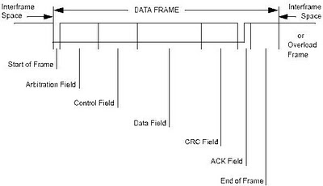
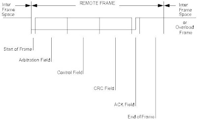

## CANFD (vs `CAN`)

- Extended CAN frame. 
- Can send larger payloads.
- A bit different structure.
- Using CANEdge2 for testing the CANFD frames.

## CAN Communication in IT systems

CAN (Controller Area Network) was invented around late 1980's for automotive industry (_Robert Bosch GmbH_), due to large number of electrical systems and electronical subsystems in modern vehicles. Alternative to a large number of different wires (hardwiring) that was commonly used prior to CAN invention resulted in global usage and approaches for it, and the protocol implementation found its way in other different autmoation and manufacturing production systems. The CAN is oriented as a network packet way of communication, defined by the standards: `ISO11898` and also, `ISO 11519-2`.

The basic properties of CAN communication are:

- **Robustness:** resistance to interference, detection and correction of transmission errors
- **High communication speed:** up to 1 Mbit/s with a bus length of up to 40 m, or 40 kbit/s with a bus length of 1000 m
- **Reliability:** advanced error detection methods, error isolation, automatic fault detection
- **Real-time operation:** short messages; CSMA/CD+AMP bus access method in which no time is lost on negotiating access
- **Flexibility:** no fixed addressing scheme (the system is message-oriented), allowing CAN nodes to be dynamically added or removed; the number of nodes is limited only by the physical properties of the medium
- **Multiple nodes** can simultaneously receive a specific piece of data
- **Low cost** of the transmission medium and CAN controllers

---

### CAN Packet Frames

- **Data Frame** – contains up to 64 bits of user data

- **Remote Frame** – used to request specific data; the response is a data frame

- **Error Frame** – used to signal errors in the system
- **Overload Frame** – used when a station is not ready to receive and requests a delay in the transmission of a data or remote frame

---

### CSMA/CD+AMP

CSMA/CD+AMP protocol is a modified CSMA/CD protocol, [such as the one used in Ethernet](/ethernet-specifications):

- Implemented so that no additional time is spent on bus access arbitration
- At the beginning of each packet, arbitration bits are used to determine packet priority – the highest priority is assigned to the packet containing the greatest number of dominant bits
- Devices must be connected to the bus using “wired-AND” logic (where 0 is the dominant bit)
- The highest-priority packet is guaranteed to be transmitted on the bus, while lower-priority packets must retry
- Arbitration bits also represent the message identifier

### Other Resources

* [Designing CAN-Bus Circuitry: CAN-Bus PCB Layout Guidelines](https://resources.altium.com/p/can-bus-designing-can-bus-circuitry)
* [ZBCAN: A Zero-Byte CAN Defense System](https://www.usenix.org/conference/usenixsecurity23/presentation/serag)
* Presentation: [Exposing New Vulnerabilities of Error Handling Mechanism in CAN](https://www.usenix.org/conference/usenixsecurity21/presentation/serag) ~2021